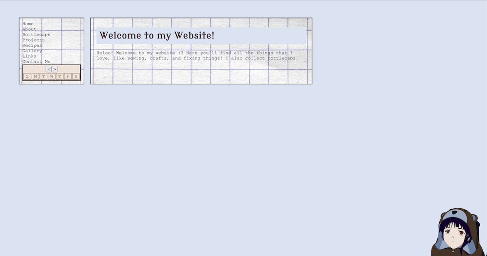

Welcome to my first project post! Each of these posts will document whatever project I've been working on recently. I thought it'd be appropriate that my first post would be about the process of making this website.

amameow has been my main obsession(?) since around the beginning of March or so, after my friend Evelyn suggested I make a personal website. I'd been thinking it over I guess, and the thought of making my own home page — a place I could build from nothing, on my own, filled with whatever I wanted — was really exciting for me.

So on March 8, 2026, I decided to make a Neocities account!

It would've been unimaginable for me a few years ago to start with little more than an `index.html` file and understand how to start making a website. And honestly, part of my excitement in beginning this project was that I'd be able to apply the skills I'd learned throughout my degree, and have something to show for it that I could call my own. Maybe I actually learned something valuable I'll carry with me?!

<!-- 

The entire reason I wanted to study computer science was that it was a sphere of knowledge that appeared so mysterious to me. I had no framework for understanding how things appeared on a computer screen and how humans are able to create or control computers. I didn't even really understand what a screen is, how computation occurs, what even is computation. But my degree taught me (some of) those things! 

I can understand, more-or-less, that computers are made up of circuits powered using electrcity. Data is stored as 0s (off) and 1s (powered) on registers on a processor, and those registers are read and manipulated using "circuit logic"? controlled by input or output signals. Instructions are computed, machine code gets executed. When your computer first boots, a set of instructions runs your BIOS firmware (built into your computer's motherboard!), which launches your operating system, which sets up what you think of as your "computer".

And your operating system is actually, unsurprisingly, a huge piece of code which lets you interact with the computer and tells the computer what to show you. When you type in the command line, click on things, your OS runs some code to decide what those actions mean, and tells your computer to re-render the screen to reflect the results.

Anyway, programming languages and their compilers/interpreters, turn human-readable code into bits and bytes your processor can understand. Everything builds on top of each other and stuff other people have written or made, and it's all a big system that people have spent decades contributing to and optimizing.

Imagine me being 14 and not really understanding any of that. I didn't know how someone could just *make* something like, say, Minecraft. I knew what a programming language was, but even after learning a bit a Java I had no idea how you could go from if-else statements to graphics, user interaction, sounds, etc.

Web programming was a bit like that for me too, except instead of having trouble understanding how to make things appear, I encountered the next hurdle of getting it to do what I wanted. HTML tags were easy enough to understand. Typing `` would make `picture.jpg` appear. When I opened a tumblr theme to try and edit it, I didn't even know where to begin to comprehend what the hell was going on. 

 -->

The main reason I was drawn to computer science in the first place was my desire to be able to understand this connection between "code" and "thing you can open and click and it does stuff". And I think that's essentially what this website is and that is satisfying! It does a lot of things and I can get it to do more by typing more code!

## The Beginning 

I had no idea what I wanted my website to look like, so the first couple days I was just playing around with colors and looking at other peoples' websites. The only things I did know were that:

1. I wanted to have a persistent sidebar
2. I wanted my website to be responsive (work on all screen resolutions)
3. I wanted good performance and the experience to be really smooth
4. Madoka Magica

Tbh, I really struggle with graphic design! Staring at my empty project was like staring at a blank sheet of paper. So I just started doing shit? I don't really plan things out and kinda just use trial and error to see what I like. This is what my website looked like after the first couple days:

In the beginning, I started coding my project locally and tested it by opening `/index.html` as a file in my browser. This did not last very long, because one of the first things I tried to do was use [AJAX](https://www.w3schools.com/whatis/whatis_ajax.asp) to fetch and load the content of my website without having to load/reload pages. Unsurprisingly, I started getting [CORS errors](https://developer.mozilla.org/en-US/docs/Web/HTTP/Guides/CORS/Errors/CORSRequestNotHttp) and switched to testing on a local server instead.

I kept on developing locally for a while, using VSCodium's Live Preview extension to see my changes. I was able to make a welcome page and nav bar. I also had AJAX somewhat working; when I clicked a link in my nav bar, instead of unloading `/index.html` and loading `/about/index.html`, it calls a JavaScript function that takes the content from `/about/index.html` and pastes it into the content area of `/index.html`. No screen blinking as the page reloads! I basically took bits from [this Stack Overflow question](https://stackoverflow.com/questions/17636528/how-do-i-load-an-html-page-in-a-div-using-javascript) and [this YouTube video](https://www.youtube.com/watch?v=ZleShIpv5zQ) to make the first version of my AJAX loader.

### An Issue Arises

However, I encountered a problem! When I click on my nav bar link to my `about` page, everything is fine because my JavaScript will run and paste the content of `/about/index.html` into the main content area of `/index.html` and change the url bar to say `amameow.neocities.org/about`. But what if someone follows the link [amameow.neocities.org/about](https://www.amameow.neocities.org/about)? That html file only has main content with no nav bar, like this:

Okay, so I'll just paste the nav bar code to `/about/index.html`.

Wait, I used AJAX in the first place because I don't want to have to edit every single page on my website when I want to edit my nav bar. Ah! But what if I used AJAX to fetch/paste the main content when I click a nav link AND load my nav bar onto every page when it loads? 

I'm a genius, problem solved! So I start writing a base template .html file and create a section for my JavaScript to load my nav and a section to hold my main content. Then I copy this template to every `/about/index.html`, `/bottlecaps/index.html`, etc. Wait, but what if I want to edit this template and add something like a footer to every page? I'll have to edit every .html file for every page of my website. Hmm, maybe I can write a script that takes a template and inserts content into it. 

Wait a second, isn't that just a templating engine?

## Moving to a Static Site Generator

TLDR; I did not end up writing my own templating engine.

I quickly realized my initial ambition to write this website using nothing but .html .css and .js files would not work for the type of project I had in mind. Most of my pages would look pretty much the same, and I wanted a lot of them. After all, each of these project posts is its own html file!

So I decided to look into static site generators. Honestly I didn't really know what these were before I started using Neocities. The only web libraries/frameworks I had used were React, Vue, and a bit of Bootstrap in school. I'd seen SSGs mentioned on other peoples' websites and the [Neocities tutorial page](https://neocities.org/tutorials), but hadn't given them much thought. Surely I wasn't going to make somethin that complicated? 

I ended up checking out the SSGs Neocities recommended and settled on [Hugo](https://gohugo.io/). I didn't want to use something too similar to React or Vue because I'd already worked with those before, and the golang templating syntax looked like what I had in mind. 

Little did I know, Hugo was more complicated than I thought and I took quite a bit of time learning the names it called everything. I spent a good few days reading documentation and discourse questions to fully understand what was going on. See the [Hugo resources](https://amameow.neocities.org/links#hugo-resources) section of my links page for some resources that I wish I'd found at the beginning!

## It Kinda Works?

Once I figure out how to make new pages and call JavaScript from them, things went pretty well (this took a while though, because I am dumb). 

I spent hours a day coding and styling and reloading and having a lot of fun! I fixed my nav bar issues, created a calendar with working next/prev month buttons (referencing this [tutorial](https://www.geeksforgeeks.org/javascript/how-to-create-a-dynamic-calendar-in-html-css-javascript/)), added a recipes page, made a gallery, made a modal, restyled my website, decorated it with pictures, and uploaded all my bottlecaps. 

I wrote a Python script that resizes all my images to more reasonable sizes to improve load times (hopefully no one out there wanted to view my gallery images in 4K). I also wrote a Python script that would use `git diff --name-only --cached` to find changed files and upload them to my site using the Neocities API! I felt pretty cool when it first worked B). 

But as my website got bigger, I decided maybe I want to show my code and all the work I put into it, so I published everything to my [GitHub](https://github.com/amandah6/amameow) and now use the [deploy-to-neocities](https://github.com/marketplace/actions/deploy-to-neocities) action to properly do CI/CD, which is arguably more robust than my 20-line Python script.

## The Future

I'm going to work to keep adding pages! I want to make posts about my recent sewing projects while I still remember most of the details. I also want to add more fun code to my bottlecaps page that lets you sort/filter/interact with it! Now that I'm more comfortable with Hugo and have re-acclimated to working in JavaScript, I keep getting new ideas for stuff I wanna implement.
